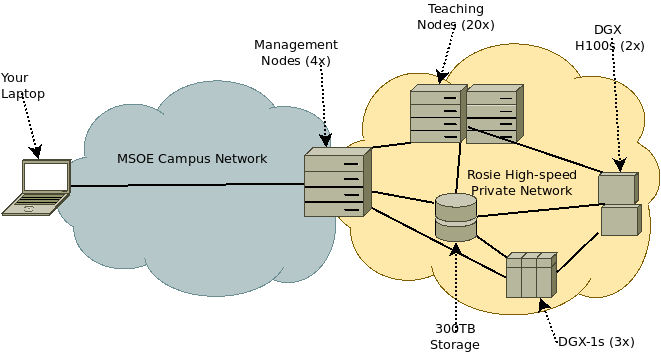

## Rosie Overview

<center>

</center>

Rosie is a *cluster* of 29 computers (called *nodes*) which are connected together by a high-speed private network.  Four of the nodes are *management* nodes, and are also accessible on the MSOE campus network. From these, we use SLURM to run *jobs* on the compute nodes of the cluster.  The compute nodes have GPUs and are intended for long-running computation-heavy tasks.  All nodes share a 300TB networked storage device.

## Management Nodes

The four management nodes are `dh-mgmt1.hpc.msoe.edu`, `dh-mgmt2.hpc.msoe.edu`, `dh-mgmt3.hpc.msoe.edu` and `dh-mgmt4.hpc.msoe.edu`. There is also a virtual machine `dh-ood.hpc.msoe.edu` which hosts the Open OnDemand web portal.  Users should avoid using `dh-mgmt1` directly if possible.

## Compute Nodes

ROSIE has 3-4 different types of computational processing nodes. There are currently 25 compute nodes on the cluster.

| Partition | Node<br/>Count  | Processor | CPU<br/>Count  |    RAM    | GPU | GPU<br/>Count   | VRAM | Cuda<br/>Capability |
|:----------|:---------:|:-------|------:|--------|-------|:------:|----:|:----:|
| `teaching` | 18/2 | Intel Xeon Gold 6240 @ 2.60GHz | 72 | 376GB | T4 | 4 |  16GB | 7.5 |
| `highmem` | 2 | Intel Xeon Gold 6240 @ 2.60GHz | 72 | 752GB | T4 | 4 | 16GB | 7.5 |
| `dgx` | 3 | Intel Xeon CPU E5-2698 v4 @ 2.20GHz | 80 | 503GB | V100-SXM2 | 8 | 32GB | 7.0 |
| `dgxh100` | 2 | Intel(R) Xeon(R) Platinum 8480CL @ 2.0GHz| 224 | 1.87TB | H100 | 8 | 80GB | 9.0 |

The `highmem` nodes are also present in the `teaching` partition.  Similarly, all `teaching` nodes are also `batch` and `desktop` nodes.

Currently, one of the DGX-H100 nodes has been set aside for use as a model server.

## Storage

All nodes in ROSIE mount two network drives from a common 300TB storage device.
ROSIE has two high speed access 100TB storage nodes.

- All `/home` directories share a 100TB network drive
- The `/data` resource share is a 200TB network drive containing datasets and code samples for faculty and student research projects.

This means you can access your home folder files and research data files with the same filepaths, regardless of which node you are currently using.

## Software Stack

**OpenOnDemand**

A web browser access friendly portal for complete and versatile Rosie usage.

[Web Portal Guide Page](web/dashboard.md)

**SLURM**

A job scheduling system built to handle robust uses of compute clusters.

More details in [Command Line Interface Guide Pages](cli/SLURM.md)

* SLURM Documentation [link](https://slurm.schedmd.com/documentation.html)
* SLURM `man` pages: 

  ```bash
  $ man srun
  $ man sbatch
  ```

**Singularity**

A container runtime commonly used in HPC applications.  Many commonly-used ilbraries are available as Singularity containers.

* Singularity Documentation [link](https://sylabs.io/guides/3.10/user-guide/index.html)
* Singularity help in the terminal:

  ```bash
    $ singularity --help
  ```