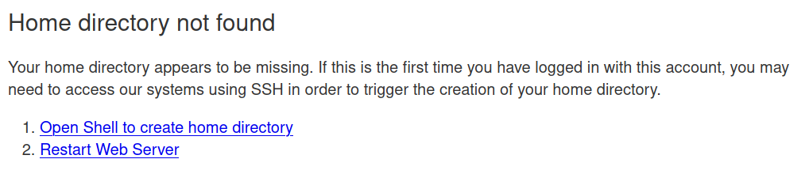
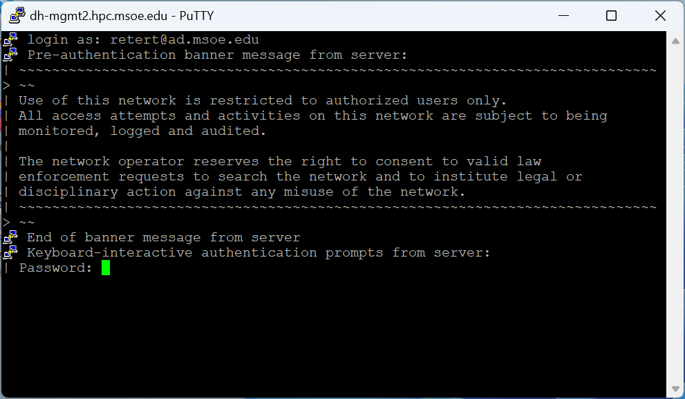

The cluster is only accessible on the campus network. If you are connecting from a building on campus, you are likely already attached to the campus network.

To access Rosie off campus, you must **first connect to the MSOE VPN**. Download a vpn client and log in with your campus credentials (@msoe.edu address).

## Vpn Clients

On **Windows** or **Mac**, you can download the GlobalProtect client from [vpn.msoe.edu](https://vpn.msoe.edu).

On **Linux**, a popular option is to use [openconnect](https://www.infradead.org/openconnect/index.html). Many distributions include openconnect with their default package manager. After you install openconnect, in your terminal execute: `sudo openconnect --protocol=gp vpn.msoe.edu`. 

## Your Rosie Cluster Account

Rosie is connected to your campus account.  The web portal should sign you in with single-signon. If you connect with ssh, you will need to enter your password.  Your account name ***must*** include `@ad.msoe.edu` (e.g. `username@ad.msoe.edu`).

**Note: You must log in via shell before you can use the web portal.**  If you log into the web portal first, you will likely see an error:



If you get this error, click the first link to shell in using your MSOE password, then click the second link to restart the web server.

While you can log in with your campus credentials, you will need access to SLURM in order to run jobs.  If you have enrolled in a CS course which uses Rosie, you likely already have a SLURM account.  If not, you can [submit the form](requestaccess.md).

An error like the one below indicates that you do not have SLURM access.


## Shell Access

Users can directly connect to the management nodes and open a command line interface.

Connect with **ssh** to management node 2, 3, or 4.

```bash
# connect to mgmt2
$ ssh username@ad.msoe.edu@dh-mgmt2.hpc.msoe.edu

# connect to mgmt3
$ ssh username@ad.msoe.edu@dh-mgmt3.hpc.msoe.edu

# connect to mgmt4
$ ssh username@ad.msoe.edu@dh-mgmt4.hpc.msoe.edu
```

### SSH Terminal Program

**Windows** 

The Windows Operating System does not include ssh by default. There are a number of popular options.

* [PuTTY](https://www.putty.org/) is a classic cross-platofrm solution. Provides users with a ssh terminal login window capable of GUI support. [Getting Started Guide](https://the.earth.li/~sgtatham/putty/0.74/htmldoc/Chapter2.html#gs)
* Windows Subsystem for Linux [Guide](https://docs.microsoft.com/en-us/windows/wsl/install-win10). Brings a linux terminal program to the Windows OS.
* Download and install [GIT](https://git-scm.com/). The included git bash terminal program has a ssh command.

**Mac or Linux**

Your operating system includes this by default, yay! Launch terminal and issue `which ssh` to see the location of the ssh program binary file.

Then enter the ssh connect commands above.

*More info about SSH available on the [OpenSSH homepage](https://openssh.com).*

### Connecting with PuTTY on Windows

1. Install the PuTTY program

2. Launch PuTTY, a PuTTY Configuration Dialog pops up

3. In the host name field input a managment node hostname, e.g. `dh-mgmt2.hpc.msoe.edu`


4. Click Open

5. Input your Rosie username and password.



## Web Browser Access

Users can use their web browser to interact with Rosie in a 
variety of ways. More information in the [Web Portal](web/dashboard.md) section of guide.

[Rosie Web Portal link](https://dh-ood.hpc.msoe.edu)

**Note:** Users must initialise their account via Shell before being able to access the web terminal.

