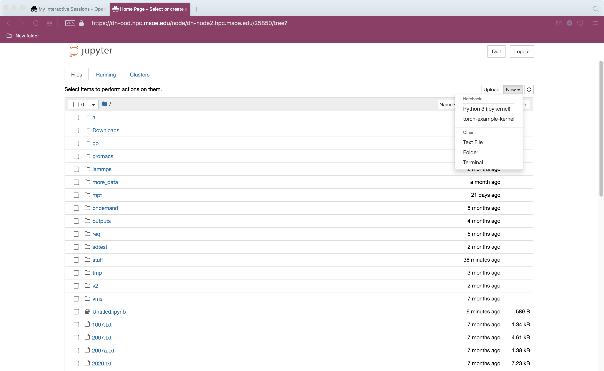

### Python Environments

There are a number of common python packages installed in the system
distribution.  However, you may need to install additional packages
for projects you are working on.

## User environment

All accounts have their own *user* python environment.  Packages may be
installed there using `pip` with the `--user` flag.

```
sysadmin@dh-mgmt2:~$ pip3 install mysql-connector --user
Processing ./.cache/pip/wheels/57/e4/98/5feafb5c393dd2540e44b064a6f95832990d543e5b4f53ea8f/mysql_connector-2.2.9-cp38-cp38-linux_x86_64.whl
Installing collected packages: mysql-connector
Successfully installed mysql-connector-2.2.9
sysadmin@dh-mgmt2:~$ 
```

These pacakages are stored in your home directory under
`~/.local/lib/python3.?/site-packages` This means that they will be
present on all containers nodes and even in singularity containers.
In particular the user environment cannot be customized to different
projects.

***Be careful!*** The user package will take precedence over an older
version of the same library from inside a container.

## Conda environments

`conda` is a tool for managing python environments.  It enables you to
make different sets of pacakages available to different projects.  The
packages become available when the environemnt is activated.

```
sysadmin@dh-mgmt3:~$ conda activate
(base) sysadmin@dh-mgmt2:~$ 
```

The `(base)` at the start of the command line indicates that the base
conda environment is now active.  Programs, packages and libraries in
that environment are now available for use.

```
(base) sysadmin@dh-mgmt2:~$ conda deactivate
sysadmin@dh-mgmt2:~$ 
```

The environment can be deactivated when you no longer want to use
those packages.

# Named `conda` Environments

Above we activated/deactivated the "`base`" conda environment.  As
with the default packages,users cannot alter this environment.
However, you can create your own named conda environemnts using `conda
create` Here we will use a running example of creating an environment
for PyTorch; however, in practice, we would run PyTorch in its
singularity container.

```
sysadmin@dh-mgmt2:~$ conda create -n torch pytorch
Collecting package metadata (current_repodata.json): done
Solving environment: done
  .
  .
  .
Proceed ([y]/n)? y


Downloading and Extracting Packages
  .
  .
  .
done
#
# To activate this environment, use
#
#     $ conda activate torch
#
# To deactivate an active environment, use
#
#     $ conda deactivate

sysadmin@dh-mgmt2:~$ 
```

The environment can then be activated by name.

```
sysadmin@dh-mgmt2:~$ conda activate torch
(torch) sysadmin@dh-mgmt2:~$ python ./test_torch.py 
Cuda is available? False
(torch) sysadmin@dh-mgmt2:~$ conda deactivate
sysadmin@dh-mgmt2:~$ python ./test_torch.py 
Traceback (most recent call last):
  File "./test_torch.py", line 1, in <module>
    import torch
ModuleNotFoundError: No module named 'torch'
sysadmin@dh-mgmt2:~$ 
```

If the conda environment contains a version of python, then running
`pip` instide the environemnt will install in that environment, rather
than your user environment.


```
sysadmin@dh-mgmt2:~$ conda create -n torch python
Collecting package metadata (current_repodata.json): done
Solving environment: done
  .
  .
  .
Preparing transaction: done
Verifying transaction: done
Executing transaction: done
#
# To activate this environment, use
#
#     $ conda activate torch
#
# To deactivate an active environment, use
#
#     $ conda deactivate

sysadmin@dh-mgmt2:~$ conda activate torch
(torch) sysadmin@dh-mgmt2:~$ pip install torch
Collecting torch
  .
  .
  .
Installing collected packages: typing-extensions, nvidia-cuda-runtime-cu11, nvidia-cuda-nvrtc-cu11, nvidia-cublas-cu11, nvidia-cudnn-cu11, torch
Successfully installed nvidia-cublas-cu11-11.10.3.66 nvidia-cuda-nvrtc-cu11-11.7.99 nvidia-cuda-runtime-cu11-11.7.99 nvidia-cudnn-cu11-8.5.0.96 torch-1.13.1 typing-extensions-4.4.0
(torch) sysadmin@dh-mgmt2:~$ python ./test_torch.py 
Cuda is available? False
(torch) sysadmin@dh-mgmt2:~$ conda deactivate
sysadmin@dh-mgmt2:~$ python ./test_torch.py 
Traceback (most recent call last):
  File "./test_torch.py", line 1, in <module>
    import torch
ImportError: No module named torch
sysadmin@dh-mgmt2:~$
```

While it is preferred to explicitly activate the environment, you can
run code in it directly if you know hte correct path.

```
sysadmin@dh-mgmt2:~$ ~/.conda/envs/torch/bin/python ./test_torch.py
Cuda is available? False
sysadmin@dh-mgmt2:~$ 
```

# Conda and Jupyter Notebooks

To use your conda envornment in a Jupyter notebook, you will need to
compile a kernel for that environment

```
sysadmin@dh-mgmt3:~$ conda activate torch
(torch) sysadmin@dh-mgmt3:~$ conda install ipykernel
Collecting package metadata (current_repodata.json): done
Solving environment: done
  .
  .
  .
Executing transaction: done
(torch) sysadmin@dh-mgmt3:~$ ipython kernel install --user --name=torch-example-kernel
Installed kernelspec torch-example-kernel in /home/sysadmin/.local/share/jupyter/kernels/torch-example-kernel
(torch) sysadmin@dh-mgmt3:~$ conda deactivate
```

Once the kernel is installed, you can create a new notebook using that
kernel, or change the existing kernel from the Kernel menu

